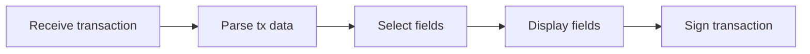

## UI good practices

The vast majority of applications are mainly designed to sign a transaction. Although they share a similar goal, their implementation varies greatly.

### Transaction signature flow

The application's structure should follow this pattern:

In order to produce an easily maintained, readable codebase composed of reusable components, each of these steps should be cleanly cut.
It is sometimes tempting to mix in the parser with the rest of the code, or format data for printing within the parser, but doing so produces code that is hard to test or maintain.

Here is a detailed description of each step:

1. **Receive:** the transaction is sent through one or more APDUs. If this transaction is too large to be sent at once, it is copied chunk by chunk into a global buffer.
2. **Parsing:** the various fields of the transaction are read. This step is devoted to making sure the transacation is correctly formed and extracting its fields. Its logic must be as simple as possible.  We recommend making use of zero-copy mechanisms, for both security and memory footprint reasons. It is more efficient to store only the address of a buffer and its size than copying it entirely somewhere else.
3. **Selection:** when the transaction is deemed valid, its fields must be printed to the user. Those field vary a lot depending on the transaction type and the selection logic is not always apparent.  This is the reason why separating the selection step from the parsing step is important. The output is a table of elements to be printed, each represented by its identifier, its type and its associated data (an integer for the "integer" type, a pointer and a length for a string, or just a pointer for a fixed-size array for example)
4. **Display:** This step iterates over those fields. Each of them must be made human-readable through formatting and then displayed on screen. The formatting should take place only then and not sooner.
5. **Signing:** if the user validates the transaction then it is signed and its signature is sent back to the user by the application.

Rationale: From experience reviewing lots of applications, the above structure allows writing easy-to-follow, maintainable and testable applications.  Easy-to-follow because each step only does one thing.
Maintainable because adding a transaction type only affects steps 2 and 3, minimizing changes. Testable because each step can be tested independently, increasing code coverage.

Last important consequence is the ability to write reusable components. The functions related to receiving, structures used during the selection phase, formatters and parsing building blocks can be reused in another application.

The [Solana app](https://github.com/LedgerHQ/app-solana) is a great example of such architecture.
We recommend developing a portable library implementing all the complex steps of the signature flow (parsing, field selection and field formatting) as he libsol library from Solana does.

### Good Practices for Transaction Handling

Parsing transaction data, extracting important fields from this data, and showing them to the end user is the complex part of cryptocurrency applications for hardware wallets. This is where most time of the security review is spent.

A significant part of the work can be automated. We make extensive use of static analysis, using [Clang Static Analyzer](https://clang-analyzer.llvm.org/) and [Coverity Scan](https://scan.coverity.com/), and dynamic analysis tools ([AFL](https://lcamtuf.coredump.cx/afl/), [libFuzzer](https://llvm.org/docs/LibFuzzer.html), [valgrind](https://valgrind.org/)).

To use these tools correctly, the security team adapts, most of the time, the application code. This task is tedious, and is the main reason why security reviews take, sometimes, a longer time than expected. Here are a few recommendations to write robust code, with better security guarantees:

- **Do not rely on the BOLOS SDK to handle transaction data**

Transaction handlers can be split, as seen above, in 5 parts. Only very specific areas require using the BOLOS SDK: receiving data from USB or BLE, displaying a formatted field on the screen, and signing the transaction data. These parts should be clearly separated from the rest of the core library responsible to handle transactions.

This library should be portable. This will result in modular and testable code. Hence, a good practice for transaction parsers and printers is to put them in dedicated files. Such files should not include headers from the SDK. Do not include "`os.h`", "`cx.h`" nor "`os_io_seproxyhal.h`" in such files.

- **Document the transaction format**

Transactions are structured data. The structure of this data is sometimes well documented. In other cases, there is no documentation exception the code repository of the project. And, in some cases, even this code is ambiguous and does not define correctly how data has to be encoded.

Using a app that does not read correctly transaction data on a hardware wallet makes no sense: one of the advantages of having a hardware wallet is to control what you sign, and to make sure that what you see is what you sign. For these reasons, every cryptocurrency app *should* link to a thorough documentation of the transaction format.

As we do not require app developers to write a full documentation for transactions if it does not exist yet, we ask for minimal test cases for every kind of transaction handled by the application. We also ask to document the kinds of transactions that are not handled by the application.

To ensure test cases cover a major part of the transactions supported by your application, developers can rely on [code coverage](https://clang.llvm.org/docs/SourceBasedCodeCoverage.html), which becomes easy to add if your transaction parsers and printers are portable. We do not enforce a minimal percentage of coverage for unit tests. Nevertheless, we reserve the right to reject an app during the security review if we consider it cannot be tested easily.
