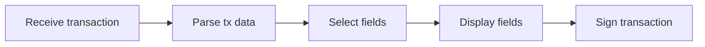

import { Callout } from 'nextra/components'

# Security

## Requirement Note

Your device app must comply with all the Security requirements (Updated in April 2023). Security aspect apply to building the code, testing, (including automated testing), the use of BOLOS flags, the derivation path, exception calls, the handling of key-derived secrets, the signing process. The list is not exhaustive.

Ledger will not pass the Security Audit for an App if potential errors have been detected by the Ledger guidelines enforcer GitHub workflow available [here](https://github.com/LedgerHQ/app-boilerplate/blob/master/.github/workflows/guidelines_enforcer.yml). This includes a static code analyzer and a checker which verifies icons, `Makefile`, `README.md` and some application parameters (detailed in the sections below). 

Make sure you run this worflow in your GitHub repository and that all issues be corrected.

In addition, your repository must have a test folder that contains at least your functional tests. Unit tests are highly recommended.

## Introduction

Developing applications for Ledger devices is an intricate process. The security of the user funds relies on the fact that the application works in a correct and secure manner and that potential attackers cannot misuse it to extract private data and/or sign requests which are not authorized by the user. The app should guard against such attacks because they have a very low entry point -- a Ledger device attached to a compromised host might be a victim of the attacker's program sending invalid/non-standard requests to the device.

<Callout type="warning" emoji="⚠️">
  This guide is meant to be a summary of all important aspects of Ledger Apps security and it shall be read by developers before developing an app for Ledger.
</Callout>

## Development practices

This part details several tips and recommendations to assess the security of your Ledger app.

### Perform Manual Code Reviews

We encourage all written code to be peer-reviewed. Importantly, the review should have at least:

1. One reviewer proficient in C and knowing C security weaknesses.
2. One reviewer with a "hacker's mind" (looking at the code from the perspective of an attacker).

### Automate Code Reviews with Static Code Analysis

Our SDK provides a simple automated analysis on your application code. It is based on [Clang Static Analyzer](https://clang-analyzer.llvm.org/). To use it, refer to https://github.com/LedgerHQ/ledger-app-builder#code-static-analysis

It will output an HTML report describing all the potential vulnerabilities it has identified.

In addition, this analysis is also done as part as the Ledger guidelines enforcer GitHub workflow. Integrating such check in CI ensures no trivial vulnerability has been introduced in new code.

<Callout type="warning" emoji="⚠️">
  Ledger will not sign an app if potential errors have been detected by Clang Static Analyzer.
</Callout>


Rationale: Problems identified by the static analysis are easy to fix, and allow the security team to detect the more obvious vulnerabilities. Moreover, it prevents developers from using unsafe string manipulation functions such as `strcpy`. Using such tool improves code quality over time.

### Automate Security Check with CodeQL

In order to increase code security, use static analysis based on [CodeQL](https://codeql.github.com/docs/) to perform security checks.
CodeQL can be directly integrated into your project by creating a new YAML file: `.github/workflows/codeql-workflow.yaml` in your repository.

A complete [codeql-workflow.yml](https://github.com/LedgerHQ/app-boilerplate/blob/0cdb0059e4f374b796b25ed347202c5e4e3e558a/.github/workflows/codeql-workflow.yml) file is available in the repository of the Boilerplate app.

The first part of the file is an initialization of what is needed to build your Ledger app and a declaration of languages used in your code so CodeQL analyzes it in the right way.

```yaml copy
jobs:
  analyse:
    name: Analyse
    strategy:
      matrix:
        sdk: [ "$NANOS_SDK", "$NANOX_SDK", "$NANOSP_SDK" ]
        language: [ 'cpp' ]
    runs-on: ubuntu-latest
    container:
      image: ghcr.io/ledgerhq/ledger-app-builder/ledger-app-builder-legacy:latest
```

The action part needs 4 steps:

- Clone your repository
- Initialize CodeQL:
  - Declaration of which languages are used and the chosen queries. Please choose the `security-and-quality` queries.
- Build the app. Be careful : the initialization of CodeQL needs to be done before building the app so that CodeQL makes the code dictionary during the building stage.
- Perform the CodeQL analysis

```yaml copy
steps:
  - name: Clone
    uses: actions/checkout@v3

  - name: Initialize CodeQL
    uses: github/codeql-action/init@v2
    with:
      languages: ${{ matrix.language }}
      queries: security-and-quality

  - name: Build
    run: |
      make BOLOS_SDK=${{ matrix.sdk }}

  - name: Perform CodeQL Analysis
    uses: github/codeql-action/analyze@v2
```

Next the results of CodeQL are displayed on your GitHub security view, in the “Code scanning alerts” panel. If CodeQL is configured to run when a pull request (PR) on some branches is made, the results will also be shown in the “Checks” parts of the PR.


### Avoid Warnings during compilation

Apps must build with no warnings. This verification is also done as part of the Ledger guidelines enforcer GitHub workflow (verified during the static code analysis phase). No warning should be intentionally disabled.

<Callout type="warning" emoji="⚠️">
  Ledger will not sign an app if warnings are emitted during compilation.
</Callout>

Rationale : Former SDKs used to generate lots of errors - sometimes dozens - when compiling an application. This had the unfortunate consequence of discouraging developers from reading the compilation output and miss potentially important alerts that could be well be vulnerabilities.

### Test requirements and Code review

In order to ease security reviews and maintenance, the Ledger Security Team requires these development requirements to be met:

- Functional tests must be present. They should allow APDU testing thanks to the [Speculos](../tools/speculos) OS emulator (or a real device). We highly recommend to use [Ragger](https://github.com/LedgerHQ/ragger) and [Pytest](https://pytest.org) as a testing framework if tests are written in Python.
- Unit tests are strongly recommended - especially for critical functions like parsers - preferably in the `tests/` folder and relying on a standard framework like [cmocka](https://cmocka.org/). Having these allows building fuzzers more easily, ensuring a shorter review.

These best practices must be automated using GitHub actions to achieve continuous integration. The [functional tests workflow](https://github.com/LedgerHQ/app-boilerplate/blob/master/.github/workflows/build_and_functional_tests.yml) and [Unit tests workflow](https://github.com/LedgerHQ/app-boilerplate/blob/master/.github/workflows/unit_tests.yml) of the Boilerplate app act as a reference.
On top of that, we also encourage the following practices:

- Linting helps improving code quality and ensuring consistent coding style and resolving basic coding errors.
- Developing a fuzzer thanks to [libFuzzer](https://llvm.org/docs/LibFuzzer.html).
- Integration with the Coverity static code analysis tool helps finding security issues and software defects.

They should also be included in the GitHub workflow.

<Callout type="warning" emoji="⚠️">
  Ledger will not sign an app if functional tests are not present.
</Callout>

### Ask for External Security audits

We encourage third-party security reviews. Note, however, that solid review takes time and a short review might yield a false sense of security (especially if the reviewing party does not have an extensive knowledge of Ledger code specifics).

## App Permissions

Every application has an associated set of permissions, ranging from system-related permissions such as the ability to modify system configuration or being able to request user PIN verification, to hardware wallet functionalities like the ability to derive specific keys only accesible to one particular app.

The following sections details how those permissions are granted. It is crucial to uphold the principle of least priviledge: each application must use permissions only absolutely necessary to its execution.

Please not that these app parameters are verified as part of Ledger guidelines enforcer GitHub workflow. These app parameters must be listed in the Ledger apps [database](https://github.com/LedgerHQ/ledger-app-database). Coherence between app `Makefile` and apps database is also checked in the workflow.

<Callout type="warning" emoji="⚠️">
  Ledger will not sign an app if its parameters have not been registered in Ledger app database.
</Callout>

### Application flags

Priviledges or permissions of an application are defined within its Makefile through the `--appFlags` parameter.
This bitfield is documented [here](https://github.com/LedgerHQ/nanos-secure-sdk/blob/master/include/appflags.h).


Most notable flags are:

- `APPLICATION_FLAG_BOLOS_SETTINGS (0x200)` : the application can read and modify system parameters such as the device's name.
- `APPLICATION_FLAG_GLOBAL_PIN (0x40)` : the application can request a user PIN verification or query the number of tries left before the device erases its own memory.
- `APPLICATION_FLAG_LIBRARY (0x800)` : the application behaves (or rather can also behave) as a library and exports functions that can be reached from other applications.

A common use of the APPLICATION_FLAG_BOLOS_SETTINGS is for using BLE channel on Nano X. The Nano S and Nano S Plus do not have such a channel however. Which means the Makefile has to treat the `--appFlags` separately for each device type, like so:

```makefile copy
ifeq ($(TARGET_NAME), TARGET_NANOX)
APP_LOAD_PARAMS=--appFlags 0x200  # APPLICATION_FLAG_BOLOS_SETTINGS
else
APP_LOAD_PARAMS=--appFlags 0x000
endif
```

Other flags are in general not used at all.

Any use of a flag other than APPLICATION_FLAG_BOLOS_SETTINGS must be justified in the Makefile otherwise Ledger will not sign the application.

### Restrict Apps to Coin-Specific BIP32 Prefix

Ledger devices are Hierarchical Deterministic wallets, which means they can derive as many keys as necessary from a single seed as defined in [BIP-0032](https://github.com/bitcoin/bips/blob/master/bip-0032.mediawiki).
The seed is similar to the master node of a tree of subkeys. The way those trees are constructed can be arbitrary but it is recommended it follows a few standards.
First, we recommended the first level in this hierarchy of subkeys be always tied to a "purpose" as described in [BIP-0043](https://github.com/bitcoin/bips/blob/master/bip-0043.mediawiki).

Next, all coins must follow the logic defined in [BIP-0044](https://github.com/bitcoin/bips/blob/master/bip-0044.mediawiki). If a coin is already registered in [SLIP-0044](https://github.com/satoshilabs/slips/blob/master/slip-0044.md) then its associated application must derive keys in the registered subtree only. If it is not already registered then a subtree or "path" must be chosen and not be in conflict with any other application that might be using this subtree already.

<Callout type="warning" emoji="⚠️">
  Ledger will not sign apps whose BIP32 prefixes have not been properly set.
</Callout>

Restricting the derivation path can be done by setting the `--path` property in the app Makefile.

For example, if your application derives keys on the hardened path 44'/60', specify in your Makefile:

``` makefile copy
APP_LOAD_PARAMS += --path "44'/60'"
```

Derivation can also be restricted to a specific curve using the `--curve` property. Supported curves are `secp256k1`, `secp256r1`, `ed25519` and `bls12381g1`.

Several curves and paths can be configured at the same time. For example, if your app must derive keys on paths 44'/535348', 13' and 17', on curves Ed25519 and prime256r1, the Makefile should contain:

``` makefile copy
APP_LOAD_PARAMS=--curve ed25519 --curve prime256r1 --path "44'/535348'" --path "13'" --path "17'"
```
<Callout type="warning" emoji="⚠️">
  Ledger will not sign apps where lock on curves has not been properly set.
</Callout>

Rationale: Setting prefixes is crucial, as it limits the amount of damage an attacker can cause if they manage to compromise an application. If a vulnerability is exploited on a poorly written or backdoored application, an attacker should not be able to exploit it to extract private keys from other apps, such as Bitcoin or Ethereum keys.

<Callout type="warning" emoji="⚠️">
  If your application derives keys on the hardened path 44'/60' then the chainID parameter must be different from 0 or 1. This is necessary to avoid replaying transactions broadcoast on Ethereum-like chains on Ethereum. As a general recommendation, and to ensure a good level of privacy for the end user, we recommend to always use the correct coin type in the derivation path as defined in <a href='https://github.com/satoshilabs/slips/blob/master/slip-0044.md' className='alert-link'> slip44 </a>
</Callout>

## Application Architecture

The vast majority of applications are mainly designed to sign a transaction. Although they share a similar goal, their implementation varies greatly.

### Transaction signature flow

The application's structure should follow this pattern:



In order to produce an easily maintained, readable codebase composed of reusable components, each of these steps should be cleanly cut.
It is sometimes tempting to mix in the parser with the rest of the code, or format data for printing within the parser, but doing so produces code that is hard to test or maintain.

Here is a detailed description of each step:

1. **Receive:** the transaction is sent through one or more APDUs. If this transaction is too large to be sent at once, it is copied chunk by chunk into a global buffer.
2. **Parsing:** the various fields of the transaction are read. This step is devoted to making sure the transacation is correctly formed and extracting its fields. Its logic must be as simple as possible.  We recommend making use of zero-copy mechanisms, for both security and memory footprint reasons. It is more efficient to store only the address of a buffer and its size than copying it entirely somewhere else.
3. **Selection:** when the transaction is deemed valid, its fields must be printed to the user. Those field vary a lot depending on the transaction type and the selection logic is not always apparent.  This is the reason why separating the selection step from the parsing step is important. The output is a table of elements to be printed, each represented by its identifier, its type and its associated data (an integer for the "integer" type, a pointer and a length for a string, or just a pointer for a fixed-size array for example)
4. **Display:** This step iterates over those fields. Each of them must be made human-readable through formatting and then displayed on screen. The formatting should take place only then and not sooner.
5. **Signing:** if the user validates the transaction then it is signed and its signature is sent back to the user by the application.

Rationale: From experience reviewing lots of applications, the above structure allows writing easy-to-follow, maintainable and testable applications.  Easy-to-follow because each step only does one thing.
Maintainable because adding a transaction type only affects steps 2 and 3, minimizing changes. Testable because each step can be tested independently, increasing code coverage.

Last important consequence is the ability to write reusable components. The functions related to receiving, structures used during the selection phase, formatters and parsing building blocks can be reused in another application.

The [Solana app](https://github.com/LedgerHQ/app-solana) is a great example of such architecture.
We recommend developing a portable library implementing all the complex steps of the signature flow (parsing, field selection and field formatting) as he libsol library from Solana does.

### Good Practices for Transaction Handling

Parsing transaction data, extracting important fields from this data, and showing them to the end user is the complex part of cryptocurrency applications for hardware wallets. This is where most time of the security review is spent.

A significant part of the work can be automated. We make extensive use of static analysis, using [Clang Static Analyzer](https://clang-analyzer.llvm.org/) and [Coverity Scan](https://scan.coverity.com/), and dynamic analysis tools ([AFL](https://lcamtuf.coredump.cx/afl/), [libFuzzer](https://llvm.org/docs/LibFuzzer.html), [valgrind](https://valgrind.org/)).

To use these tools correctly, the security team adapts, most of the time, the application code. This task is tedious, and is the main reason why security reviews take, sometimes, a longer time than expected. Here are a few recommendations to write robust code, with better security guarantees:

- **Do not rely on the BOLOS SDK to handle transaction data**

Transaction handlers can be split, as seen above, in 5 parts. Only very specific areas require using the BOLOS SDK: receiving data from USB or BLE, displaying a formatted field on the screen, and signing the transaction data. These parts should be clearly separated from the rest of the core library responsible to handle transactions.

This library should be portable. This will result in modular and testable code. Hence, a good practice for transaction parsers and printers is to put them in dedicated files. Such files should not include headers from the SDK. Do not include "`os.h`", "`cx.h`" nor "`os_io_seproxyhal.h`" in such files.

- **Document the transaction format**

Transactions are structured data. The structure of this data is sometimes well documented. In other cases, there is no documentation exception the code repository of the project. And, in some cases, even this code is ambiguous and does not define correctly how data has to be encoded.

Using a app that does not read correctly transaction data on a hardware wallet makes no sense: one of the advantages of having a hardware wallet is to control what you sign, and to make sure that what you see is what you sign. For these reasons, every cryptocurrency app *should* link to a thorough documentation of the transaction format.

As we do not require app developers to write a full documentation for transactions if it does not exist yet, we ask for minimal test cases for every kind of transaction handled by the application. We also ask to document the kinds of transactions that are not handled by the application.

To ensure test cases cover a major part of the transactions supported by your application, developers can rely on [code coverage](https://clang.llvm.org/docs/SourceBasedCodeCoverage.html), which becomes easy to add if your transaction parsers and printers are portable. We do not enforce a minimal percentage of coverage for unit tests. Nevertheless, we reserve the right to reject an app during the security review if we consider it cannot be tested easily.

- **Do not throw exceptions in parser code**

BOLOS provides an exception mechanism, designed primarily to minimize the application code size. Using this exception mechanism is mandatory to perform some system calls: code calling a syscall must be enclosed in a TRY / CATCH block (as seen in [Application Structure](./io/application-structure/)).

This model is fine for simple functions. It is not adapted for complex code such as transaction parsers. A major drawback of such a model is that it becomes hard to make the code testable: unit tests are hard to write, as no testing framework support custom C exceptions.

Static analyzers such as Clang Static Analyzer or Coverity Scan give improper results with such code because they do not correctly handle `setjmp` / `longjmp` (the underlying functions used in the BOLOS exception model). Moreover, writing a fuzzer for such code requires parts to be rewritten. This takes time, and this rewrite must be done each time a new version of the application is out, as the fuzzable code is different from the production code.

Finally, experience showed that developers have difficulties to correctly handle errors thrown by exceptions. There were errors related to exceptions in every single app security reviews we performed in 2020.

For these reasons, we strongly advise developers to avoid using the exception mechanism in transaction parsers and printers, unless they correctly understand the error-handling model, and they are able to provide unit tests for these modules.

## Cryptography

This section presents general concepts about cryptography development, but also guidelines specific to the security model of the Ledger devices. It gives guidelines to:

- Ensure a potential vulnerability in one application will not cause damages to other apps.
- Make sure all the operations that manipulate secrets are approved by the user.
- Restrict the use of these secrets by apps.

### Never store or export secrets derived from seed

The seed allows the user to derive any key from a given path at will. The user can reconstruct this secret from a new device by reentering its seed if he were to lose the original device.

Generating secrets must be done on demand. An application **must not** store a secret derived from the seed, and should regenerate it instead then erased when it is not used anymore.

Even in encrypted form, those secrets **must not** not be stored outside of the device. They can be regenerated instead.

### Avoid blindly signing data

**You should never allow signing of any attacker-controlled message unless it has been verified for structural validity. Importantly, you should never sign a message that might be a hash of transaction.**

Rationale: If you allow an attacker to blindly sign a message, it can easily supply a hash of a valid transaction. Your signature could then be used to send an unauthorized transaction.

If you want to sign user-supplied "personal" messages, prefix them with a fixed string (which shouldn't be a valid transaction prefix). It is also a good practice to include message length in the text to be signed. Ledger-app-eth has a good example in function `handleSignPersonalMessage`. Note that sometimes cryptocurrencies have a standardized way of signing such personal messages and in that case you should use the approved scheme.

Warning: If you allow signing untrusted hashes (while displaying a prompt to the user), be aware that

1. Some users are not familiar with security and could be easily tricked. They can click through your prompt without properly checking unless you give them explicit "Warning: this is a very unusual operation. Do not continue unless you know what you are doing" warning. They might not see the message even then.
2. A compromised host might both change hash on the screen and also data sent to device. This opens the possibility of users signing something they didn't want to.

### Signing/disclosing keys without user approval

<Callout type="warning" emoji="⚠️">
  You must always require user approval for signing transactions/messages.
</Callout>

Rationale: If you do not require user consent for signing important data, an attacker can use your device as a signing black box and sign whatever they want.

<Callout type="info" emoji="👉">
  You might also consider approvals for extracting public keys, as some users might want extended privacy.
</Callout>

1. They might not want to reveal their *root/account* public key, only address keys
2. They might not want to reveal address public key until it is required. (Some cryptocurrencies use addresses that are hash of public keys. It is therefore enough to send the address to the host).

<Callout type="info" emoji="👉">
  There is a trade-off between privacy and usability here. If you want privacy, it would require a user interaction every time they want to use Ledger device, as opposed to only interaction while signing transactions. The behaviour could also be manually set in the application options.
</Callout>

### Don't roll your own crypto primitives

**You should never roll your own crypto primitives** (including encryption/derivation schemes, hashing functions, HMAC, etc.)

Rationale: It is a purpose of BOLOS operating system to perform these in a secure manner. Importantly, writing your own crypto primitives is likely to open you to side-channel attacks or other problems. If your primitive is not supported by BOLOS (e.g., some very new cryptography), consult with Ledger developers the possibility of including it in the OS.

### Avoid Exceptions for Cryptographic Code

From the 2.0 version of the SDK every cryptographic function has a version that returns an error code instead of raising an exception. As an example `cx_ecdsa_sign_no_throw` performs the same computation as `cx_ecdsa_sign` but does not raise any exception and returns CX_OK if everything went fine.

We enforce using all `_no_throw` equivalents when available, as the ones raising exceptions are deprecated in a future SDK release.

Rationale: the exception mechanism is not standard C, and is difficult to use, particularly for error management. There were errors related to this exception model in every single app we reviewed in 2020.

### Private Key Management

**You should minimize the code that works with private (ECDSA, RSA, etc.) or secret (HMAC, AES, etc.) keys.** Importantly, you should always **clear the memory** after you use these keys. That includes key data and key objects.

Leaving parts of private or secret keys lying around in memory is not a security issue on its own because there is no easy way to extract the RAM content on the chip. If a key is left in RAM by an app, another app will not be able to access it.

However, if the key has not properly been erased, a security issue could lead to the leak of this key, even if it is not used anymore. An attacker able to read arbitrary memory from the app, or execute arbitrary code, will be able to read the content of the stack segment, hence the parts of the key which have not been erased.

Here is an example of a common and **wrong way** of doing this:

``` c copy
uint8_t privateKeyData[64];
cx_ecfp_private_key_t privateKey;

os_perso_derive_node_bip32(
    tmpCtx.transactionContext.curve, tmpCtx.transactionContext.bip32Path,
    tmpCtx.transactionContext.pathLength, privateKeyData,
    NULL);
cx_ecfp_init_private_key(tmpCtx.transactionContext.curve, privateKeyData,
                         32, &privateKey);
explicit_bzero(privateKeyData, sizeof(privateKeyData));

// (later, after privateKey is not needed)
explicit_bzero(&privateKey, sizeof(privateKey));
```

In the happy path, the previous code will correctly clean the memory once the private key is initialized. Note, however, that this code **fails to protect private keys in case some system call throws (for example cx\_ecfp\_init\_private\_key)**. Correct code should wrap the clearing in `BEGIN_TRY { TRY { ... } FINALLY { explicit_bzero() } END_TRY;`.

Applications where such issues were fixed include [the ARK app](https://github.com/LedgerHQ/app-ark/commit/e84a4dc0c422f7ade586c831cbab56cb15c64df1) and [the Solana app](https://github.com/LedgerHQ/app-solana/pull/5/files).

## Corner Cases

This part describes possibly insecure patterns found in specific cryptocurrencies, and how to handle them.

### Be Wary of Untrusted Input

Some cryptocurrencies do not have *explicit* fee encoded in the transaction. In such cases, the app cannot rely on the fee value sent from the host. Instead, it should receive previous UTxOs and check their output amounts. Note that this usually needs to be done in a separate step due to memory constraints. Check the BTC app design for this.

### Properly protect data you wish to cache on the host computer

Sometimes your app needs to compute over more data than it can fit inside memory. Taking an example from the previous section, it might not be easy to store all UTxOs in the device memory. As such, you might break computation into multiple steps and, for example, verify each UTxO separately and let the host computer cache a "certified summary". If you do this, be aware that

1. If the information you want the host to cache is public, you still need to attach a signature to it so that the host cannot send some other value later. This could be done with standard HMAC digest. We would recommend using a temporary (per session) key for this --having a per-session HMAC allows you to truncate the digest size (e.g., you don't need to have HMAC which withstands years of brute-force attack. Instead, you can balance the digest size against some reasonable upper bound on how long the session lives (e.g., one month should be enough)).

2. If the information is not public, you need to both encrypt and provide a signature. Notably, it is not enough to "scramble" the data by XORing with a random key as this would still allow the attacker to tamper with the values. (Or even break the scrambling if you re-use the same key).

    Instead:

    - Encrypt the information with a sufficiently strong cypher
    - Provide a digest to avoid tampering with the value

### Do not allow the host to freely manipulate key-pairs

Some cryptocurrencies (notably Monero) need to perform an extensive calculation with *(public, private)* key-pair spread over multiple APDU exchanges. If you need to do the same, **do not** allow the attacker to step out of the protocol. Notably, allowing the attacker to freely perform key manipulation (e.g., group multiplications, exponentiations, etc.) could undermine your app security **even if the private key never leaves the device**. In general, keep an explicit protocol state machine during the computation. Also, consult with cryptography experts to check for implications if you misstep from the protocol.
