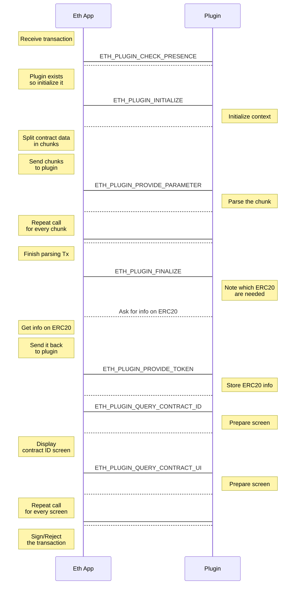

import { Callout } from 'nextra/components'

# Ethereum plugins

## Why Plugins?

Plugins display specific smart contracts information to the users to avoid blind signing. They work hand-in-hand with the Ethereum App.

The Ethereum App handles parsing, signing, screen display etc. The only thing your plugin needs to do is:

1. Extract the relevant information from the data.
2. Send the string to be displayed back to the Ethereum App.

## Sequence diagram

Here is the detailed sequence diagram of the interaction between the Ethereum application and the plugin:

## Integration walkthrough

Follow [this documentation](https://ethereum-plugin-sdk.ledger.com/) to integrate your Ethereum Plugin.
