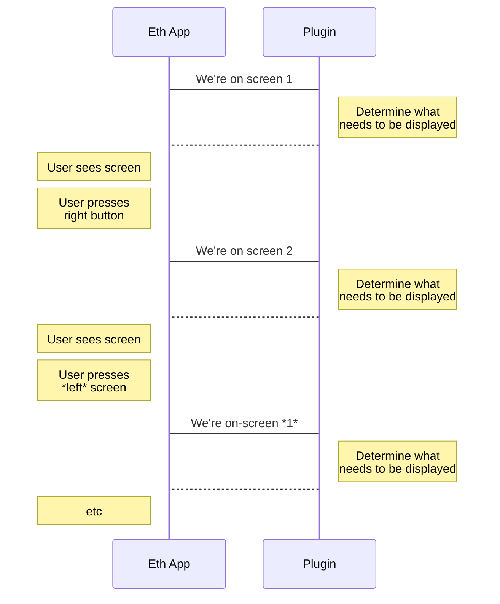

# Query Contract UI

The previous section showed how to display a single screen. This section shows how to display the rest of the screens. Similarly to the section before, the display itself is handled by the Ethereum App. The only thing the plugin needs to do is determine what strings need to be displayed.

Each screen has a screen number (also called `screenIndex`). When the Ethereum App needs to display a screen, it just calls the plugin and gives it the `screenIndex`. The plugin fills `msg->title` and `msg->msg` accordingly. The Ethereum App then displays the strings. If the user presses the right button or the left button, the Ethereum App increments or decrements `screenIndex` and calls the plugin with the updated `screenIndex`. Here is the flow:



We will use `msg->title` to fill the upper line and `msg->msg` to fill the bottom one.
```
|  Ledger  |  <- msg->title
|   Rocks   |  <- msg->msg
```

In our boilerplate example, this is what we want to display for a swap:

```
         0                    1                         2                <- screenIndex
|   Send     | Receive Min.|  Beneficiary |
| ETH 0.1  | USDT 300.12  | 0x37abc...  |
```

Let's dive right into `handle_query_contract_ui.c`:

```c copy
// Switch on `screenIndex`, and call some (yet-to-be-written) function
// to set the UI accordingly.
switch (msg->screenIndex) {
    case 0:
        fn_status = set_send_ui(msg);
        break;
    case 1:
        fn_status = set_receive_ui(msg, context);
        break;
    case 2:
        fn_status = set_beneficiary_ui(msg, context);
        break;
    // Keep this
    default:
        PRINTF("Received an invalid screenIndex\n");
        msg->result = ETH_PLUGIN_RESULT_ERROR;
        return;
}


if (!fn_status) {
    msg->result = ETH_PLUGIN_RESULT_ERROR;
}
```

Let's start by writing `set_send_ui`.
```c copy
static bool set_send_ui(ethQueryContractUI_t *msg) {
    // Copy the "Send" in the upper line.
    strlcpy(msg->title, "Send", msg->titleLength);
    
    // The amount of ETH associated with this transaction is
    // located in `msg->pluginSharedRO->txContent->value.
    const uint8_t *eth_amount = msg->pluginSharedRO->txContent->value.value;
    uint8_t eth_amount_size = msg->pluginSharedRO->txContent->value.length;

    // `amountToString` is a utility function that converts 
    //  a `uin256_t` to a string. Also, `18` and `ETH` refer
    //  to the number of decimals and to the ticker respectively.
    if (!amountToString(eth_amount,
                        eth_amount_size,
                        WEI_TO_ETHER,
                        "ETH",
                        msg->msg,
                        msg->msgLength)) {
        return false;
    }

    return true;
}
```

We can write a similar function for `set_receive_ui`:
```c copy
static bool set_receive_ui(ethQueryContractUI_t *msg, context_t *context) {
    // Set the title
    strlcpy(msg->title, "Receive Min.", msg->titleLength);

    uint8_t decimals = context->decimals;
    const char *ticker = context->ticker;
    // If the token look up failed, use the default network ticker along with the default decimals.
    if (!context->token_found) {
        decimals = WEI_TO_ETHER;
        ticker = msg->network_ticker;
    }

    // This time use amountToString with the data stored in our context!
    if (!amountToString(context->amount_received,
                        sizeof(context->amount_received),
                        decimals,
                        ticker,
                        msg->msg,
                        msg->msgLength)) {
        return false;
    }
    return true;
}
```

And finally, we need to write `set_beneficiary_ui`. Remember, this screen is only shown if the recipient's address doesn't match the user's address. This was done in `handle_plugin_finalize`, where we incremented `numScreens` if the addresses were different.

```c copy
static bool set_beneficiary_ui(ethQueryContractUI_t *msg, context_t *context) {
    // Set the upper line
    strlcpy(msg->title, "Beneficiary", msg->titleLength);

    // Prefix the address with `0x`.
    msg->msg[0] = '0';
    msg->msg[1] = 'x';

    // We need a random chainID for legacy reasons with `getEthAddressStringFromBinary`.
    // Setting it to `0` means it works with any chainID :)
    uint64_t chainid = 0;

    // Get the string format of the address stored in `context->beneficiary`. Store it in
    // `msg->msg`.
    if (!getEthAddressStringFromBinary(
            context->beneficiary,
            msg->msg + 2,              // +2 here because we've already prefixed with '0x'.
            msg->pluginSharedRW->sha3, // Used by the function to calculate the hash
            chainid)) {
        return false;
    }

    return true;
}
```

And that's it for your plugin. Now you have coded everything, it is time to test!


