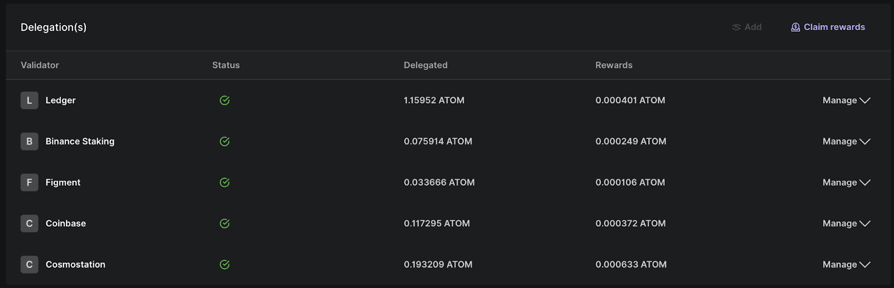
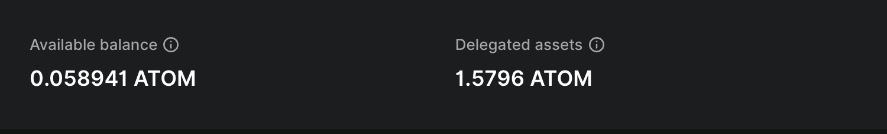

# Delegations

`AccountBodyHeader.ts` (to show current delegations & pending assets, [example](https://github.com/LedgerHQ/ledger-live/blob/develop/apps/ledger-live-desktop/src/renderer/families/cosmos/AccountBodyHeader.ts))

# Unbonding assets

# Staked balance / Free balance

`AccountBalanceSummaryFooter.tsx` (to show delegated balance, [example](https://github.com/LedgerHQ/ledger-live/blob/develop/apps/ledger-live-desktop/src/renderer/families/cosmos/AccountBalanceSummaryFooter.tsx))

