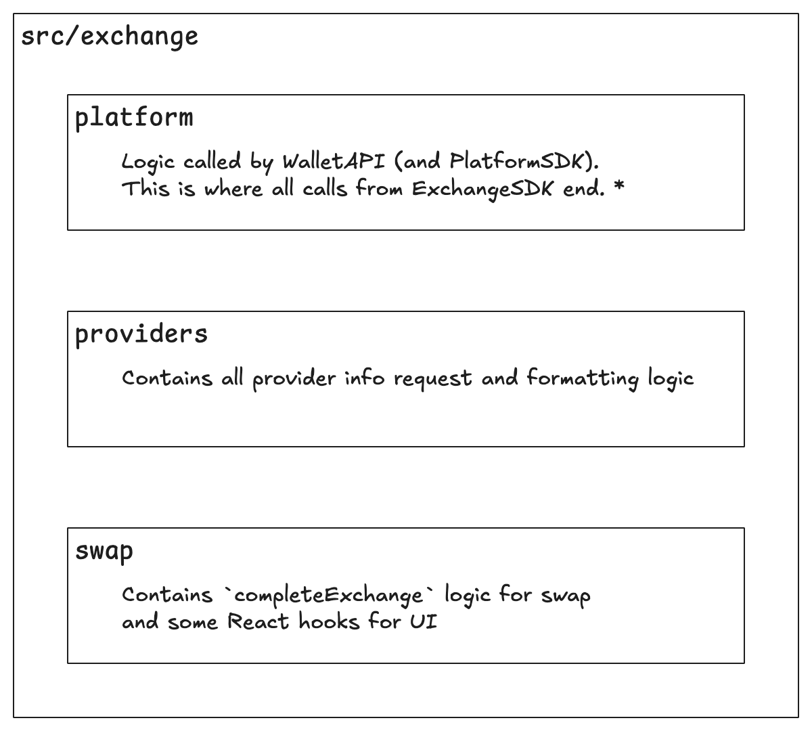

import { Callout } from "nextra/components";

# Ledger Live requirements

## Mandatory updates

https://github.com/LedgerHQ/ledger-live/pull/9096/files#diff-bc92d7ad5d7cc90ec8be2883262a16ba34ab081ea85d59f606dbcd0300b3413a

### Update WalletAPI dependencies

After updating and creating a new release for the WalletAPI, bump dependency versions for modules that have been updated (e.g.: @ledgerhq/wallet-api-core, @ledgerhq/wallet-api-server, etc.).

Once you updated all the dependencies, you will also need to update pnpm-lock.yaml file. For this, just run pnpm clean && pnpm store prune && pnpm install.

### Update test snapshots

You might also need to update the bridge integration test snapshot. Enter the apps/ledger-live-common folder and run pnpm jest src/families/COIN --coverage.

### Add coin to the list of mocked values

There’s a file that is used to mock balances from different coins libs/live-countervalues/src/mock.ts and you will need to update this to append the new coin and a mocked balance amount.

### Set coin derivation path pattern (optional)

If the coin requires a determined derivation path pattern (like Aptos needed because if follows BIP44) add the coin id to the list.

### Add coin to the list of unsupported coins for swap with Ledger Nano S

Swap is an operation that is not supported by older hardware like Ledger Nano S, and the user needs to be notified about this when swapping the coin you’re adding. Check this pull request showing the changes required on Ledger Live.

## Optional

<Callout type="info" emoji="ℹ️">
  You need to update Ledger Live Exchange Logic Code only if swap payload format
  or blockchain constraint required some extra check that are not already
  exists.
</Callout>

The startExchange checks that:

- the provider is known
- the AppExchange is installed and has the latest version
- the targeted AppCoins are installed ("from" and "to")

The `startExchange` asked the AppExchange to be launch in foreground and request it a nonce. Following the provider configuration (coming from the CAL) the nonce request has a specific format ("legacy" one or "next gen" one)

The `completeExchange` routes the request to the corresponding "exchange" logic (i.e. swap, fund or sell).

The `completeExchange` swap logic is in the "swap" folder.

