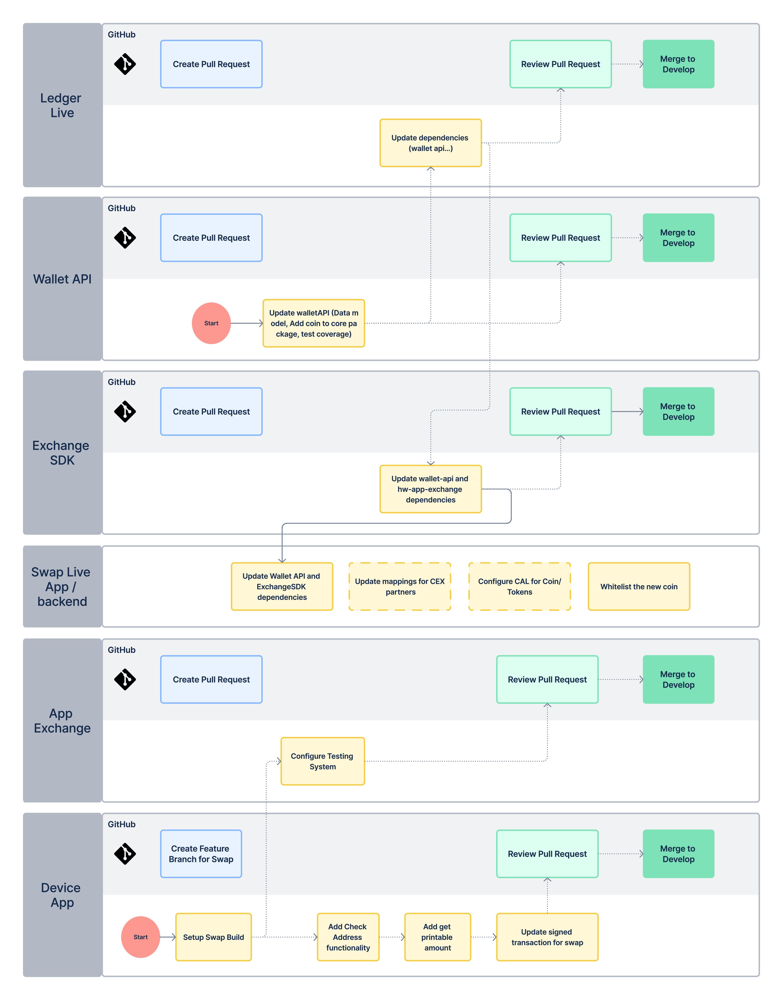

# Sequence diagram

Development can start with two parallel activities: updating the Wallet API and setting up the Swap build on the Device App side. On the Ledger Live side, the PTX Team manages the activities related to the Swap Live App and the backends, and these need to be requested from them.

