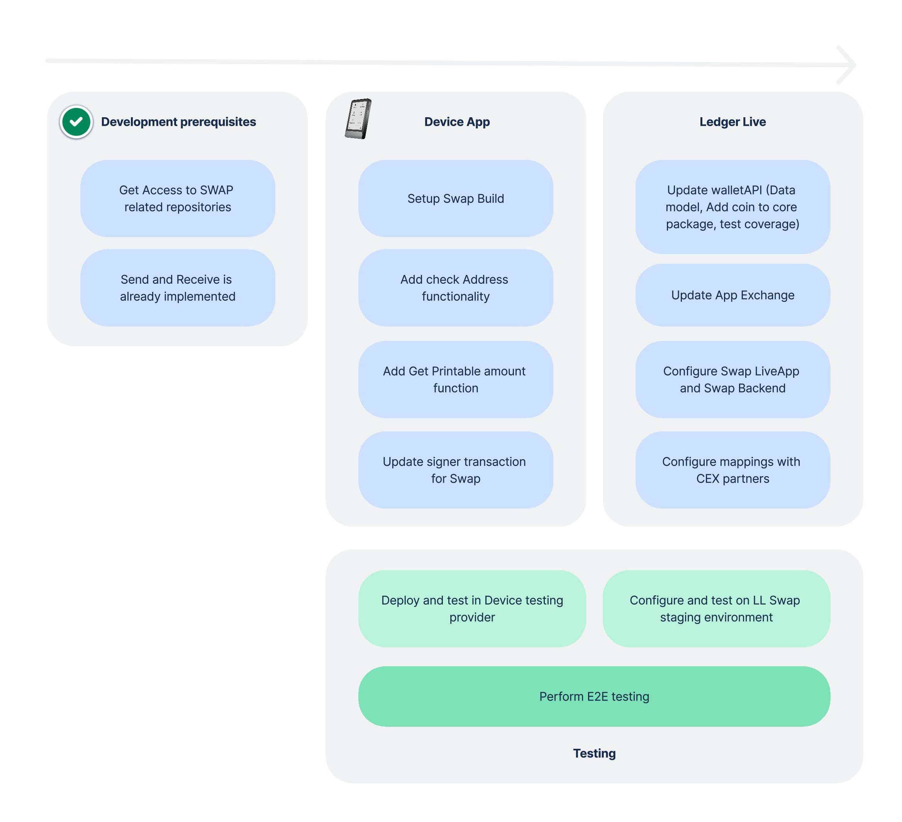

# Implementation strategy

Once all swap development prerequisites are met, the development process can begin. Configuring and enabling the swap for a specific coin requires action on two key layers: the Device App and Ledger Live.

## Device app

At this stage, the repository for the Device App is already in place, as it was initially created to support Send/Receive. You only need to create a feature branch within the repository and begin your work.

To complete the Swap implementation on the Device App, some modifications are also required in the App Exchange repository. These changes are straightforward and primarily focus on configuring the testing system.

- [Add swap to device app](https://ledgerhq.github.io/app-exchange/)

## Ledger Live

On Ledger Live side, they are very few changes to be made. The main effort is on the wallet API Side and then, we just need to update dependencies on Ledger Live and Exchange SDK.

- [Update Wallet API](./wallet-api)
- [Exchange SDK Support](./exchange-sdk)
- [Update Swap Live app](./swap-live-app)
- [Ledger Live update](./ledger-live)

The diagram below outlines the necessary activities to make the swap available on both the Device and Ledger Live:

