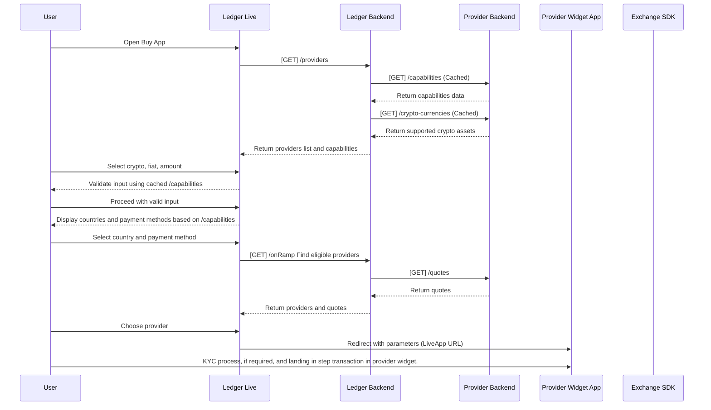

import Zoom from 'react-medium-image-zoom'
import 'react-medium-image-zoom/dist/styles.css'
import { Tabs } from 'nextra/components'
import { Callout } from 'nextra/components'

# Overview
The integration process ensures a seamless flow of data between Ledger Live, Ledger Backend, and the provider's systems. Providers are expected to implement specific endpoints and adhere to the following workflow to support the Buy feature in Ledger Live.

## Workflow Diagram

### Step 1: Open Buy App

<b>Action:</b> The user opens the Buy App in Ledger Live.

<b>Ledger Live:</b>

- Fetches capabilities data from the Ledger Backend, which caches responses from the provider's [/capabilities](https://exchange-integration-buy.redoc.ly/#operation/getCapabilities) endpoint.

- Fetches supported cryptocurrencies from the Ledger Backend, which caches responses from the provider's [/crypto-currencies](https://exchange-integration-buy.redoc.ly/#operation/getCryptoCurrencies) endpoint.

### Step 2: User Input and Validation

<b>User Interaction:</b> The user selects the cryptocurrency, fiat currency, and the amount they wish to buy.

<b>User Interaction:</b> The user selects their country and preferred payment method (e.g., PayPal, bank transfer).

<b>Validation Process:</b> Ledger Live validates user input.
Validation is performed using cached data from [/capabilities](https://exchange-integration-buy.redoc.ly/#operation/getCapabilities), ensuring the user's input aligns with provider-supported limitations (e.g., minimum/maximum amounts, supported countries).

If the input is invalid, Ledger Live displays an error message to the user.

### Step 3: Get Quotes and Select Provider

<b>User Interaction:</b> User request quote.

<b>Backend Process:</b> Ledger Backend identifies eligible providers based on the user's input.

For each eligible provider, the Ledger Backend sends a [GET] [/quotes](https://exchange-integration-buy.redoc.ly/#operation/getQuote) request to the provider backend to retrieve pricing details (e.g., the amount of fiat currency the user will receive after fees).

The provider backend returns quotes, which are aggregated by the Ledger Backend and displayed in Ledger Live.

<b>User Decision:</b> The user selects a provider from the list of quotes.

### Step 4: Redirect to Provider Widget

<b>Action:</b> Once a provider is selected, Ledger Live redirects the user to the provider's widget.

<b>Redirection Details:</b> The redirection includes required parameters as specified in the [LiveApp URL documentation](../buy/providers-liveapp), such as the selected cryptocurrency, fiat currency, amount, and user-specific details.

The user lands on the provider widget to complete the transaction details.

### Step 5: Initiate Transaction

<b>Provider Widget Interaction:</b> The user finishes the transaction in the provider widget and providers sends funds to user wallet.
