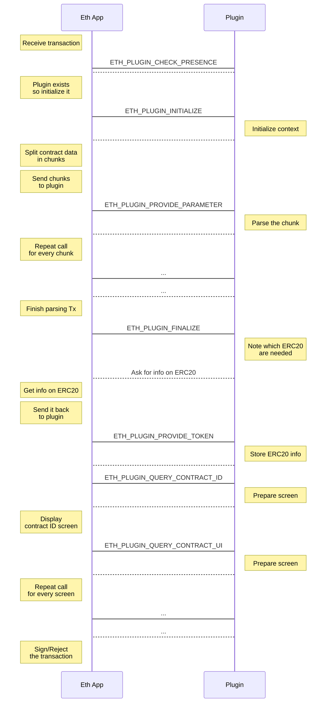

# Reference Flow

This sequence lists the interactions between the Ethereum App and the plugin in detail. If you get lost in the walkthrough, feel free to come back to it.

```mermaid
sequenceDiagram 
    Note left of Eth App: Receive transaction 
    Eth App -> Plugin: ETH_PLUGIN_CHECK_PRESENCE 
    Plugin --> Eth App: 
    Note left of Eth App: Plugin exists<br>so initialize it 
    Eth App -> Plugin: ETH_PLUGIN_INITIALIZE 
    Note right of Plugin: Initialize context 
    Plugin --> Eth App: 
    Note left of Eth App: Split contract data<br>in chunks 
    Note left of Eth App: Send chunks<br>to plugin 
    Eth App -> Plugin: ETH_PLUGIN_PROVIDE_PARAMETER 
    Note right of Plugin: Parse the chunk 
    Plugin --> Eth App: 
    Note left of Eth App: Repeat call<br>for every chunk 
    Eth App -> Plugin: ... 
    Plugin --> Eth App: ... 
    Note left of Eth App: Finish parsing Tx 
    Eth App -> Plugin: ETH_PLUGIN_FINALIZE 
    Note right of Plugin: Note which ERC20<br>are needed 
    Plugin --> Eth App: Ask for info on ERC20 
    Note left of Eth App: Get info on ERC20 
    Note left of Eth App: Send it back<br>to plugin 
    Eth App -> Plugin: ETH_PLUGIN_PROVIDE_TOKEN 
    Note right of Plugin: Store ERC20 info 
    Plugin --> Eth App: 
    Eth App -> Plugin: ETH_PLUGIN_QUERY_CONTRACT_ID 
    Note right of Plugin: Prepare screen 
    Plugin --> Eth App: 
    Note left of Eth App: Display<br>contract ID screen 
    Eth App -> Plugin: ETH_PLUGIN_QUERY_CONTRACT_UI 
    Note right of Plugin: Prepare screen 
    Plugin --> Eth App: 
    Note left of Eth App: Repeat call<br>for every screen 
    Eth App -> Plugin: ... 
    Plugin --> Eth App: ... 
    Note left of Eth App: Sign/Reject<br>the transaction 
```

