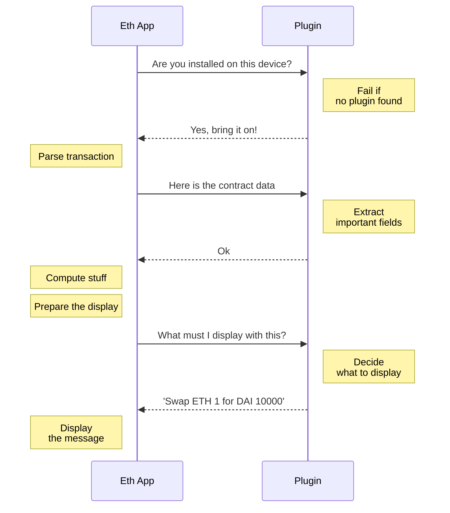

import { Callout } from 'nextra/components'

# Overview

Let’s start with a high-level overview of what a plugin is, how it interacts with the Ethereum app, and the steps required to write your plugin.

<Callout type="info" emoji="👉">
  Even though this guide is relatively beginner-friendly, you need to have prior experience of C and Solidity development.
</Callout>

## Why Plugins?

If you’ve already interacted with any smart contract using a Ledger Device, then you’ve already seen this screen:

This is a UX disaster. The user has no guarantee of interacting with the right smart contract, nor of signing the correct data. The only user action is literally to blind-sign the transaction.

Display information is specific to each smart contract: so when swapping on a decentralised exchange, you probably want to see information such as “Swapping X ETH for Y DAI”. When depositing DAI on Aave, you need to see the amount in DAI. So, the information is specific to the smart contract.

Modifying the Ethereum App would not do because its size would quickly go out of control. Instead, the solution lies in a small and versatile parser of smart contract data, which works hand-in-hand with the Ethereum App and decides what to display for the best user experience.

This is precisely what a plugin is: a small app that the user installs on their device to show just what needs to be signed. Since plugins are very small, users can install many without worrying about memory.

Ledger designed and implemented Paraswap, the first Ethereum plugin.

<iframe width="560" height="315" src="https://www.youtube-nocookie.com/embed/18lLOVoQtNo" title="YouTube video player" frameBorder="0" allow="accelerometer; autoplay; clipboard-write; encrypted-media; gyroscope; picture-in-picture" allowFullScreen></iframe>

<Callout type="info" emoji="👉">
  The second mandatory requirement to obtain official support by Ledger for your DApp is using a plugin to verify transaction details on the Ledger.
</Callout>

## Example

Plugins work hand-in-hand with the Ethereum App, and implementation is straightforward. The Ethereum App handles parsing, signing, screen display etc. The only thing your plugin needs to do is:

1. Extract the relevant information from the data.
2. Send the string to be displayed back to the Ethereum App.

Here is an overview of what the flow looks like:

As you can see, the flow is a series of back-and-forth messages between the Ethereum App and the plugin.

Before we start to code, let's set up the development environment.
