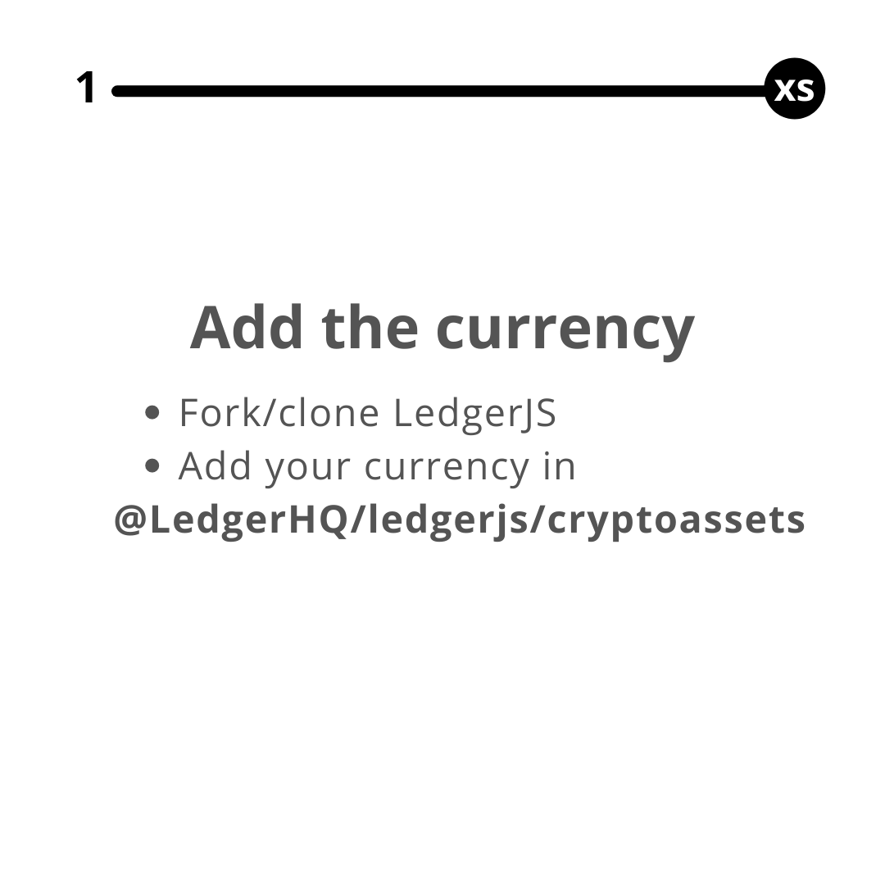
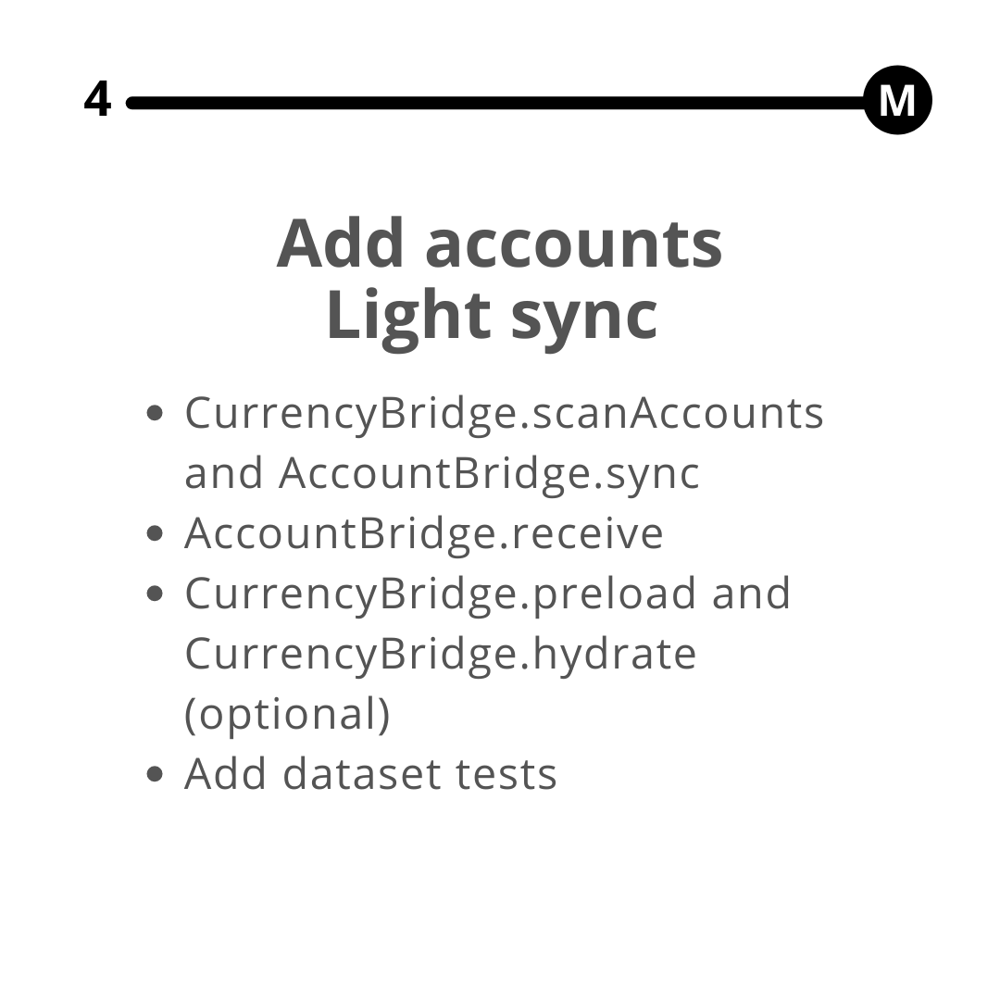
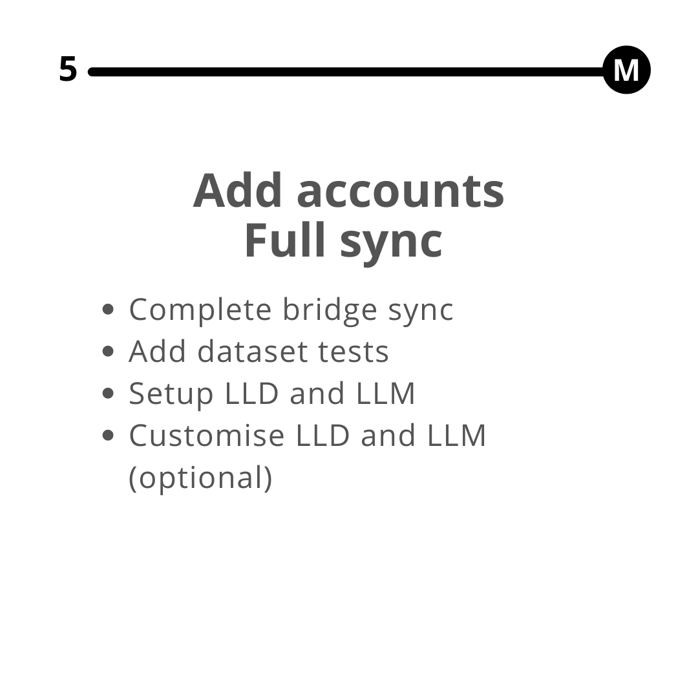

This time line shows the relative time of the steps (XS, S, M and L) you will go through for most integrations.

	

	    

			
	    

	

	

	    

			
	    

	

	

	    

			
	    

	

	

	    

			
	    

	

	

	    

			
	    

	

	

	    

			
	    

	

	

	    

			
	    

	

For any complementary implepentation (staking, tokens, NFTs), you will be guided by the Blockchain support team. 

