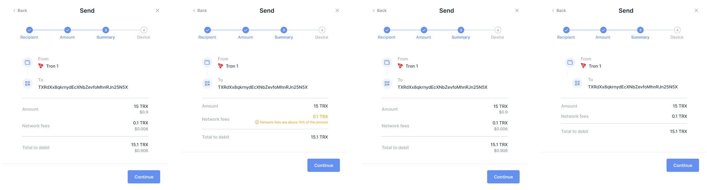
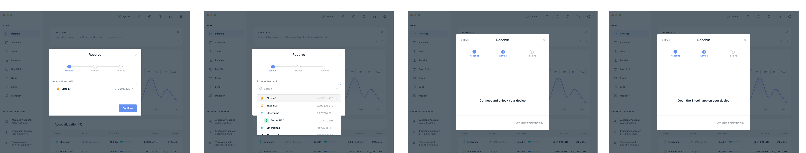
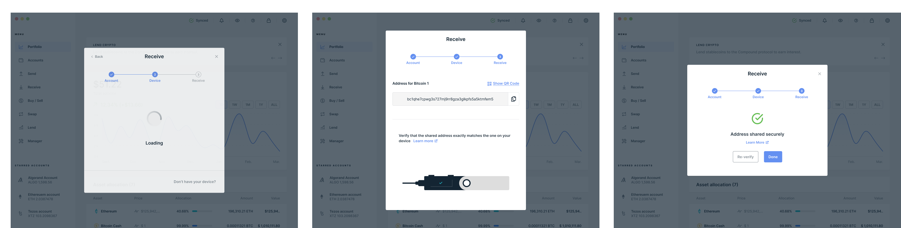

  In this page you can see the classic UI Flow used in Ledger Live Desktop. You can use it as a guide.

## Send

### Step 1 - Recipient

<figure>
	
</figure>

### Step 2 - Amount

<figure>
	
</figure>

### Step 3 - Summary

<figure>
	
</figure>

### Step 4 - Confirmation

<figure>
	
</figure>

## Receive

<figure>
	
</figure>

<figure>
	
</figure>