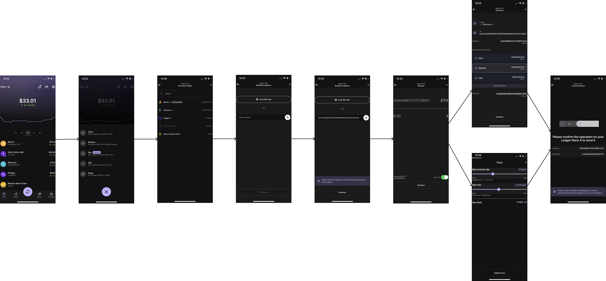

In this page you can see the classic UI Flow used in Ledger Live Mobile. You can use it as a guide.

## Send

Right click and **save image as** to have a look at the whole flow.

## Receive

Right click and **save image as** to have a look at the whole flow.
